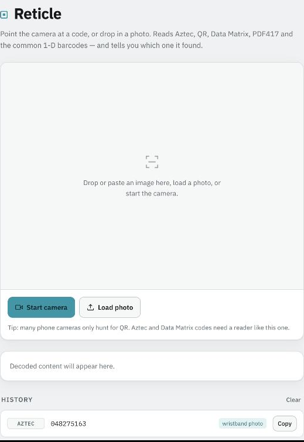

# Reticle

Read the code your phone can't. Reticle decodes **QR, Aztec, Data Matrix,
PDF417 and the common 1‑D barcodes** from an image — and tells you *which*
symbology it found. Built after a venue wristband turned out to carry an Aztec
code, which most phone camera apps silently ignore because they only hunt for QR.

Two front ends — the browser one also ships as an installable app — over one
decoder core ([zxing-cpp](https://github.com/zxing-cpp/zxing-cpp)):

| | |
|---|---|
| **`scancode`** | command-line decoder for image files (macOS/Linux) |
| **`web/reticle.html`** | single-file browser app — live camera + drop/paste a photo, nothing leaves the page |
| **`docs/`** | the same app as an installable, offline-capable PWA for your phone |



## CLI

```
./install.sh                 # creates ~/.local/share/reticle/venv, installs `scancode`
```

```
scancode IMAGE [IMAGE ...]   # decode one or more images
scancode -j IMAGE            # JSON output
scancode -v IMAGE            # verbose: report which preprocessing pass succeeded
scancode --formats           # list supported symbologies
```

Exit status is `0` only if every file yielded at least one code.

```
$ scancode wristband.jpeg
wristband.jpeg: [Aztec] 048275163

$ scancode -v qr_photo.jpg
qr_photo.jpg: [QR Code] https://example.com/kit?id=048275163  <via original>
```

### How it decodes

`scancode` hands the raw image to zxing-cpp first. If nothing is found it grinds
through a ladder of preprocessing passes — 2×/3×/0.5× rescales, Otsu threshold,
CLAHE local-contrast, unsharp mask, and 90/180/270° rotations — stopping at the
first pass that reads a code. Clean images resolve on the first try; crumpled,
glare-lit, or rotated photos usually fall out a few rungs down.

## Web app

Open `web/reticle.html` in any modern browser, or host it anywhere static.
It fetches the [`@zxing/library`](https://github.com/zxing-js/library) UMD build
lazily — the page paints first and pulls the decoder in the background, so a
slow or blocked CDN can't leave you staring at a blank screen. Everything runs
client-side: camera frames and dropped images are decoded in the page and never
uploaded. Scan history is kept in `localStorage` on that device only.

Live camera scanning needs an **https origin** (or `localhost`) — `getUserMedia`
is refused otherwise. Loading a photo works from a `file://` page too.

If you embed the page in an iframe, note that Permissions Policy defaults the
`camera` feature to `self`: a cross-origin frame gets no camera at all unless the
embedding page passes `allow="camera"`. Reticle detects this and offers the ways
out that do work — **Take photo**, which hands off to the phone's own camera app,
and **Open in a tab**, which reloads it as its own top-level page.

## Install on your phone

`docs/` is an installable PWA build: the decoder is **inlined**, and a service
worker precaches the app, so once installed it launches and scans with no
network at all.

Served by GitHub Pages from **main → /docs**, it lives at
<https://routerglock.github.io/reticle/>.

- **iPhone/iPad** — open it in Safari, tap Share, then **Add to Home Screen**.
- **Android** — Chrome offers an install prompt; the app's **Install app** button
  triggers it too.

Launched from the home screen it runs as its own top-level page, so the camera
works without the iframe caveat above.

Rebuild it after changing the web app:

```
python3 tools/build-pwa.py       # web/reticle.html + vendor/ -> docs/index.html
```

`docs/index.html` is generated — edit `web/reticle.html` instead. The rest of
`docs/` (manifest, icons, `sw.js`) is hand-maintained; bump `VERSION` in
`docs/sw.js` when you change any precached file so installed copies update.

The app still requests IBM Plex from Google Fonts, but non-blockingly — offline
it falls back to the system font stack.

## Layout

```
bin/scancode        thin wrapper -> ~/.local/share/reticle/venv
lib/scancode.py     the CLI (argparse + preprocessing ladder)
web/reticle.html    the browser app (single file, CDN decoder)
docs/               installable PWA, served by GitHub Pages (index.html generated)
tools/build-pwa.py  web/reticle.html + vendor/ -> docs/index.html
vendor/             pinned @zxing/library UMD build, inlined into the PWA
install.sh          venv setup + copy into ~/.local/bin
requirements.txt    zxing-cpp, numpy, opencv-python-headless
```

## Supported symbologies

QR Code · Micro QR · rMQR · Aztec · Data Matrix · PDF417 · MaxiCode ·
Code 128 · Code 93 · Code 39 · Codabar · ITF · DataBar · EAN‑13/8 · UPC‑A/E

## License

MIT © 2026 RouterGlock — see [LICENSE](LICENSE).
